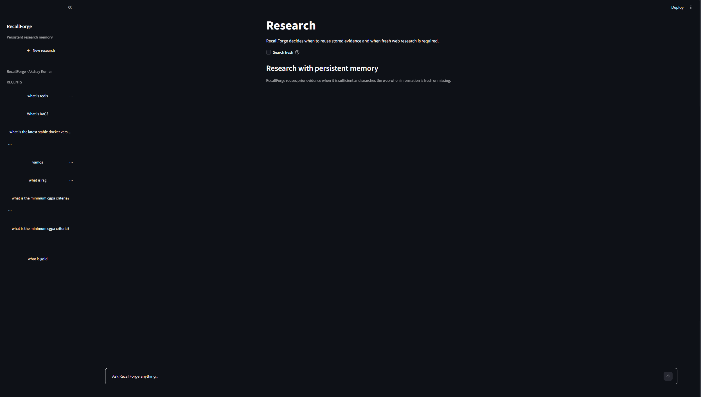
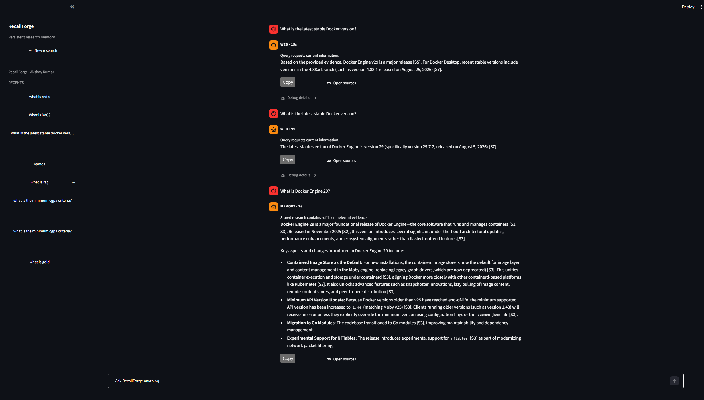
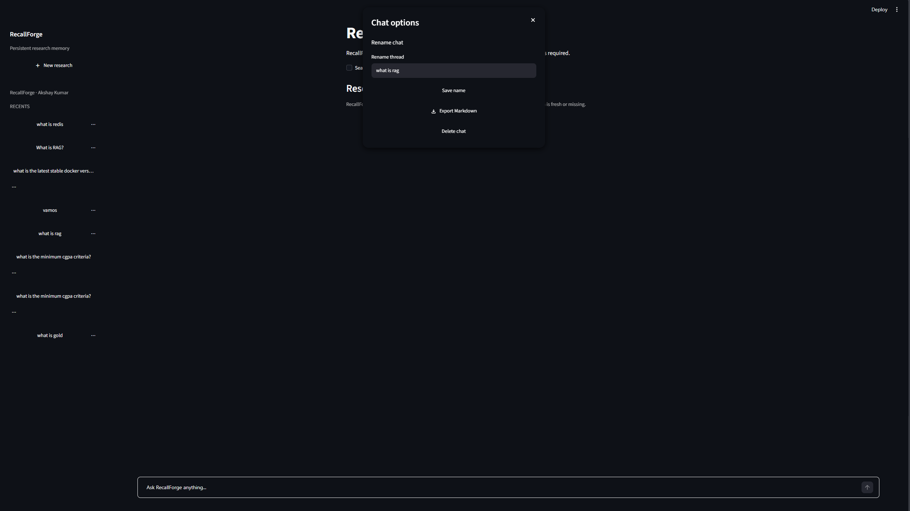

<div align="center">

# 🧠 RecallForge

### Persistent research memory that knows when to remember — and when to search.

A deterministic web-research agent that reuses prior evidence when it's sufficient, searches the live web when freshness or coverage demands it, and keeps every answer traceable to its sources.

**[🚀 Live Demo](https://recallforge-jht0.onrender.com)** · **[🏗️ Architecture](#-architecture)** · **[📊 Evaluation](#-evaluation)** · **[⚡ Quick Start](#-quick-start)**

<br>


</div>

---

## 💡 Overview

RecallForge is a **local-first research system** that accumulates web evidence across sessions and decides whether a new question can be answered from stored research — or requires fresh retrieval.

Its routing policy is explicit and deterministic:

> **freshness → semantic retrieval → semantic sufficiency → evidence coverage → answerability → `MEMORY` / `WEB`**

Unlike a conventional RAG chatbot, RecallForge doesn't blindly retrieve context for every query. It treats retrieval as a **decision problem**: reuse memory when the stored evidence is good enough, search the web when the question is fresh or under-supported, and expose the route and timing to the user.

---

## 🖼️ Screenshots

<table>
<tr>
<td align="center" width="100%">

**Research workspace**



<sub>A minimal Streamlit workspace with persistent recents, one-shot Search fresh, source controls, and a single research surface.</sub>

</td>
</tr>
<tr>
<td align="center" width="100%">

**Fresh WEB research → reusable MEMORY**



<sub>A freshness-sensitive query routes to WEB; a related stable follow-up can reuse the retained evidence through MEMORY. Debug details expose route, reason, latency, and safe retrieval diagnostics without exposing hidden model reasoning.</sub>

</td>
</tr>
<tr>
<td align="center" width="100%">

**Persistent chat history**



<sub>SQLite-backed threads can be reloaded, renamed, deleted, exported to Markdown, and displayed with relative timestamps while remaining independent from semantic research memory.</sub>

</td>
</tr>
</table>

---

## 🤔 Why RecallForge

Most research assistants fall into one of two patterns:

- they search the web on **every** turn and forget work they've already done, **or**
- they reuse semantically similar context even when it's incomplete, stale, or unable to actually answer the question.

RecallForge is built around one core distinction: **similarity is not the same as answerability.**

---

## ⚙️ Core Capabilities

| Capability | What RecallForge does |
|---|---|
| 🧠 **Persistent research memory** | Stores successful web evidence in FAISS and reloads it across restarts. |
| 🎯 **Deterministic MEMORY / WEB routing** | Route selection is driven by explicit policy gates, not an opaque LLM preference. |
| ⏱️ **Freshness first** | Current/latest/breaking-information queries bypass ordinary memory reuse. |
| ✅ **Coverage + answerability gates** | Semantically related evidence can't authorize a MEMORY answer unless it actually covers the query. |
| 🌐 **Bounded web retrieval** | Search, page acquisition, concurrency, and total research time are explicitly bounded. |
| 🛡️ **Truthful partial failures** | Successful sibling sources are retained when another source fails or times out. |
| 🔁 **One-shot recovery** | A MEMORY synthesis that reports insufficient evidence can trigger one isolated WEB attempt. |
| 📎 **Application-owned provenance** | Citation IDs like `[S1]` and `[S2]` map to authoritative source records owned by the application. |
| 🔍 **Search fresh** | Users can explicitly force WEB research for one query without changing normal AUTO behavior. |
| 📈 **Observability** | Debug details expose route, reason, timings, source counts, fallback status, and acquisition outcomes. |

---

## 🏗️ Architecture

```
                                      ┌──────────────────────┐
                                      │      User Query      │
                                      └──────────┬───────────┘
                                                 │
                                                 ▼
                                      ┌──────────────────────┐
                                      │    Streamlit UI      │
                                      │ Search fresh override│
                                      └──────────┬───────────┘
                                                 │
                                                 ▼
                                      ┌──────────────────────┐
                                      │  Freshness Decision  │
                                      └───────┬───────┬──────┘
                                              │       │
                                           fresh   not fresh
                                              │       │
                                              │       ▼
                                              │  ┌───────────────────┐
                                              │  │ Persistent FAISS  │
                                              │  │ semantic retrieval│
                                              │  └─────────┬─────────┘
                                              │            │
                                              │            ▼
                                              │  semantic sufficiency
                                              │            │
                                              │            ▼
                                              │    evidence coverage
                                              │            │
                                              │            ▼
                                              │      answerability
                                              │       ┌────┴────┐
                                              │       │         │
                                              │    MEMORY      WEB
                                              │       │         │
                                              └───────┴────┬────┘
                                                          │
                                                          ▼
                                             ┌────────────────────────┐
                                             │ Bounded Web Retrieval  │
                                             │ DDG + trafilatura      │
                                             │ partial-failure safe   │
                                             └────────────┬───────────┘
                                                          │
                                          chunk → embed → persist evidence
                                                          │
                                                          ▼
                                             ┌────────────────────────┐
                                             │    Gemini Synthesis    │
                                             └────────────┬───────────┘
                                                          │
                           MEMORY synthesis insufficient ─┘
                           → one-shot WEB fallback
                                                          │
                                                          ▼
                                             ┌────────────────────────┐
                                             │ Citation validation +  │
                                             │ sanitization/rendering │
                                             └────────────┬───────────┘
                                                          │
                                                          ▼
                                             ┌────────────────────────┐
                                             │   Answer + Sources     │
                                             └────────────────────────┘

                      ┌────────────────────────────┐   ┌──────────────────────────┐
                      │ FAISS Research Memory      │   │ SQLite Chat History      │
                      │ evidence + provenance      │   │ threads + messages       │
                      └────────────────────────────┘   └──────────────────────────┘
```

> 💡 The two persistence layers are **deliberately separate** — deleting a chat thread does not clear semantic research memory.

---

## 🎯 Routing Policy

For non-fresh questions, RecallForge searches persistent FAISS memory using **L2 distance**, where **lower is better**.

| Signal | Current policy |
|---|---|
| Strong memory match | `≤ 0.5` |
| Acceptable memory match | `≤ 1.0` |
| Freshness-sensitive query | WEB before ordinary memory reuse |

> ⚠️ These distance values are **application constants**, not universal embedding calibration. Similarity alone is not enough — evidence must also pass semantic sufficiency, coverage, and answerability checks.

### 🔁 One-shot MEMORY → WEB recovery

If routing selects `MEMORY` but synthesis returns the configured insufficient-evidence signal, RecallForge:

1. Rejects that MEMORY answer
2. Clears provenance from the rejected MEMORY attempt
3. Performs **one** bounded fresh WEB acquisition
4. Synthesizes again from the new evidence
5. Reports the final route as `WEB`

**There is no unbounded retry loop.**

---

## 🌐 Web Research Reliability

| Control | Value |
|---|---|
| DuckDuckGo search deadline | 6 s |
| Per-page fetch / extraction deadline | 10 s |
| Total web acquisition budget | 25 s |
| Maximum concurrent fetches | 4 |

Blocking fetch/extraction work is moved off the event loop. A failed or timed-out page does not discard successful sibling results — the acquisition layer preserves truthful partial-failure states.

---

## 💾 Persistent Memory & Provenance

Research memory is stored under `<storage-root>/research_memory/` and chat history under `<storage-root>/chat_history.db`.

The local storage root defaults to:
```
.storage
```

Set `RECALLFORGE_STORAGE_DIR` to move both stores together. The legacy `LINKMIND_MEMORY_PATH` variable remains supported as a backward-compatible FAISS-only override.

Research ingestion uses:
- local `sentence-transformers/all-MiniLM-L6-v2` embeddings
- FAISS vector search
- normalized SHA-256 content identity
- duplicate suppression before embedding/insertion
- persisted provenance metadata
- reconstruction of deduplication state after restart

Citation IDs such as `[S1]` and `[S2]` are **application-owned**. Unknown IDs are removed or warned about rather than converted into guessed URLs.

> Provenance improves traceability. It does not claim independent factual verification or entailment.

---

## 📊 Evaluation

> The bundled benchmark is intentionally small, authored, offline, and controlled. It's useful for **regression detection and policy comparison**, not as a statistically representative industry benchmark.

| Policy | Held-out result |
|---|---|
| Always-WEB | 8 / 16 |
| Always-MEMORY* | 11 / 16 |
| Semantic-only | 14 / 16 |
| **RecallForge** | **15 / 16** |

<sub>* The Always-MEMORY baseline still sends freshness-sensitive queries to WEB.</sub>

**Current controlled results:**

- ✅ **15 / 16** held-out routing decisions correct
- ✅ **0** false MEMORY decisions
- ⚠️ **1** false WEB decision
- **Weighted error:** 1
- **Coverage ablation:** semantic-only produced 2 false MEMORY decisions; current policy produced 0
- **Freshness suite:** 12 / 12 authored cases

> The evaluator explicitly treats synthetic distance cases as unsuitable for production threshold calibration.

---

## 🎬 Demo Flow

A simple sequence demonstrates the core product idea:

**1.** `"What is the latest stable Docker version?"`
→ **WEB** — freshness forces new research → evidence is retained

**2.** `"What is Docker Engine 29?"`
→ **MEMORY** — previously researched evidence is reused

**3.** Enable **"Search fresh"** on a known MEMORY question
→ **WEB** — explicit user override wins for that query only

> *Research fresh when necessary. Reuse safely when possible.*

---

## 🧰 Tech Stack

| Layer | Technology |
|---|---|
| Interface | Streamlit |
| Application | Python, LangChain, LangGraph |
| Synthesis | Gemini via `langchain-google-genai` |
| Embeddings | `sentence-transformers/all-MiniLM-L6-v2` |
| Vector memory | FAISS |
| Web search | DuckDuckGo via `ddgs` |
| Extraction | trafilatura |
| Chat persistence | SQLite |
| Testing | pytest |
| Deployment | Render |

---

## 📁 Repository Structure

```
RecallForge/
├── src/
│   ├── agents/        # synthesis + bounded recovery
│   ├── tools/         # routing, retrieval, web acquisition, provenance
│   ├── storage/       # storage paths + SQLite history
│   ├── ui/            # Streamlit presentation + research controls
│   ├── eval/          # controlled offline routing evaluation
│   └── documents/     # experimental; disabled by default
├── tests/
├── docs/
│   └── screenshots/
├── render.yaml
├── requirements.txt
└── README.md
```

---

## ⚡ Quick Start

<details open>
<summary><b>Windows PowerShell</b></summary>

```powershell
python -m venv .venv
.venv\Scripts\Activate.ps1
pip install -r requirements.txt
Copy-Item .env.example .env
python -m streamlit run src/main.py
```

</details>

<details>
<summary><b>macOS / Linux</b></summary>

```bash
python -m venv .venv
source .venv/bin/activate
pip install -r requirements.txt
cp .env.example .env
python -m streamlit run src/main.py
```

</details>

Add one Gemini credential to `.env`:

```
GOOGLE_API_KEY=your_key_here
```

`GEMINI_API_KEY` is also supported.

### 🔑 Environment Variables

| Variable | Purpose |
|---|---|
| `GOOGLE_API_KEY` | Default Gemini credential |
| `GEMINI_API_KEY` | Alternative Gemini credential |
| `MODEL` | Optional synthesis-model override |
| `RECALLFORGE_STORAGE_DIR` | Shared FAISS + SQLite storage root |
| `LINKMIND_MEMORY_PATH` | Legacy FAISS-only path override |

---

## 🧪 Testing

The default suite is designed to run **offline** — it does not require a Gemini call, DuckDuckGo request, or embedding-model download.

```bash
python -m compileall -q src tests
python -m pytest -q
python -m src.eval.routing_benchmark
```

**Current verification:**

```
✅ 142 tests passed
✅ 6 subtests passed
📊 routing benchmark: 15/16
   false MEMORY: 0
   false WEB: 1
   weighted error: 1
🚀 production-style Streamlit startup: PASS
```

---

## 🚀 Deployment

RecallForge includes `render.yaml` and is deployable as a Streamlit web service.

**Live demo:** [https://recallforge-jht0.onrender.com](https://recallforge-jht0.onrender.com)

> ⚠️ The public demo currently runs on a free Render instance. Free-instance local storage is ephemeral, so FAISS memory and SQLite chat history can be lost when the instance is replaced or redeployed.

For durable hosted memory, attach persistent storage and set:

```
RECALLFORGE_STORAGE_DIR=/var/data
```

Production start command:

```bash
python -m streamlit run src/main.py \
  --server.address 0.0.0.0 \
  --server.port $PORT \
  --server.headless true
```

> The local MiniLM model downloads on first use; model weights are not stored in this repository.

---


## 🔒 Security & Trust

- API keys are read from environment variables and are **not printed** by the application.
- `.env`, runtime databases, FAISS state, model caches, and local virtual environments should remain untracked.
- Persisted FAISS loading uses trusted local serialization — **do not load index data from untrusted sources.**

---

## 📄 License

See [LICENSE](LICENSE).

<div align="center">
<sub>Built with a bias toward honesty over hype — every claim above is backed by a test or a benchmark run.</sub>
</div>
